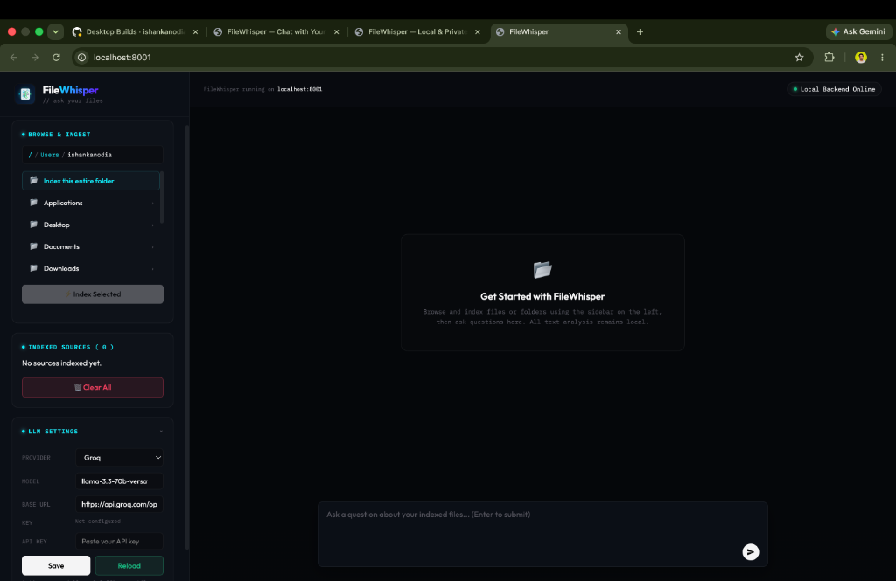

<div align="center">

# FileWhisper

### Chat with your files. 100% local. One-line install.

FileWhisper indexes documents on your computer and answers questions about them with an LLM that also runs on your computer. **Nothing leaves your machine** by default: no cloud upload, no account, no API key, and no network call at all when you ask a question.

<!--
  TIP: a short GIF beats any screenshot here. Record one (open app → drop a PDF →
  ask a question → answer appears), save it as docs/demo.gif, and replace the
   below with:  
  Free recorders: Kap (macOS, getkap.co), ScreenToGif (Windows), Peek (Linux).
-->


</div>

---

## Why FileWhisper?

- **Truly private**: parsing, OCR, embeddings, vector search **and the language model itself** run on your machine. Ask a question with the Wi-Fi off and it still answers.
- **One-line install, no setup**: no Git, Node, Rust, or manual Python. Paste one command, get a double-click app on your Desktop.
- **Works with zero API keys**: the on-device model is the default. Add a Groq/OpenAI/Claude/Gemini key only if you want faster or sharper answers, and the app tells you clearly when an answer left the machine.
- **Lightweight**: a slim ONNX stack, no PyTorch. About 500 MB of code and support models, plus a 1.4 GB on-device language model downloaded once.
- **Handles real documents**: `.txt`, `.md`, `.pdf`, and images (`.png/.jpg/.webp/.bmp/.tiff`), with automatic OCR for scanned PDFs and pictures.

## Install

### macOS & Linux

Open a **Terminal** and paste:

```bash
curl -fsSL https://raw.githubusercontent.com/ishankanodia/FileWhisper/main/install.sh | bash
```

### Windows 10/11

Open **PowerShell** and paste:

```powershell
irm https://raw.githubusercontent.com/ishankanodia/FileWhisper/main/install.ps1 | iex
```

The installer downloads FileWhisper, builds a small isolated environment (no PyTorch), pre-loads the local AI models including the ~1.4 GB on-device language model, and drops a single **FileWhisper** launcher on your Desktop. To skip the language model and let the app fetch it on first use instead, set `FILEWHISPER_SKIP_MODEL=1` before installing. After that, just **double-click FileWhisper** and it opens in your browser with **no terminal/console window**. To stop it, click **Quit FileWhisper** inside the app.

> The launcher is generated on your own machine, so macOS doesn't flag it as an "unidentified developer", it just opens. (On Linux you may need to right-click the Desktop icon → **Allow Launching** the first time.)

**To update:** re-run the same one-line command. It rebuilds from the latest version; your indexed data is preserved.

## How it works

```
your files ─► parse + OCR ─► chunk ─► ONNX MiniLM embeddings ─► FAISS index
                                                                    │
       answer ◄── on-device LLM (onnxruntime-genai) ◄── retrieve top matches ◄┘
```

A LangGraph pipeline retrieves the most relevant chunks, asks the model to answer **only** from those chunks, and suggests a follow-up question. By default every step, including generation, happens on your machine; the index lives in `~/.filewhisper/rag_data` and the model in `~/.filewhisper/models`.

If generation ever fails (no model downloaded yet, an API key that stopped working), FileWhisper falls back to an **offline reader** that answers by quoting the best-matching sentences from your own documents. It needs no model and no network, so a question about your files always gets a grounded reply, and the app says which engine answered.

## Choosing a model

Open **LLM Settings** in the app (or set environment variables for dev). The first two options never send anything off your machine:

| Provider | Example model | Private? |
|---|---|---|
| **On this computer** (default) | `qwen3-1.7b` | Yes, fully on-device |
| **Ollama / LM Studio** | whatever you have pulled | Yes, local server |
| Free Assistant (keyless cloud) | `mistralai/Mistral-7B-Instruct-v0.3` | No |
| Groq | `llama-3.3-70b-versatile` | No |
| OpenAI | `gpt-5-mini` | No |
| Anthropic Claude | `claude-sonnet-4-6` | No |
| Google Gemini | `gemini-2.5-flash` | No |
| Custom (OpenAI-compatible) | any `LLM_BASE_URL` | Depends |

### On-device models

Pick one in LLM Settings; it downloads once, with a progress bar, and you can keep using the app while it does.

| Model | Download | License | Notes |
|---|---|---|---|
| Qwen3 1.7B | 1.4 GB | Apache-2.0 | Default. Good on real documents. |
| Qwen3 0.6B | 0.4 GB | Apache-2.0 | Fastest, weaker on long numeric detail. |
| Phi-3.5 Mini | 2.8 GB | MIT | Most accurate, slower on older CPUs. |
| Llama 3.2 1B | 1.9 GB | Llama 3.2 Community | Alternative 1B. |

The on-device engine needs **Python 3.11-3.13** and does not have a build for Intel Macs. On those, FileWhisper uses a detected Ollama / LM Studio server, or the offline reader, or an API key.

Already run Ollama or LM Studio? Just start it; FileWhisper finds it on the usual loopback ports and lists your models.

```bash
# use a cloud provider instead
LLM_PROVIDER=groq
LLM_MODEL=llama-3.3-70b-versatile
GROQ_API_KEY=your_key
```

## Run from source (developers)

```bash
git clone https://github.com/ishankanodia/FileWhisper.git
cd FileWhisper
python3 -m venv .venv && source .venv/bin/activate   # Python 3.10 - 3.13
pip install -r requirements.txt
cp .env.example .env
python -m filewhisper.server_launcher   # opens http://localhost:8001
```

Python 3.10-3.13 is required (3.14+ isn't supported by the AI libraries yet), and the on-device language model additionally needs 3.11+. OCR for images and scanned PDFs is built in (ONNX, no system Tesseract required).

Pre-download the on-device model without starting the app:

```bash
python -m filewhisper.local_llm            # the default model
python -m filewhisper.local_llm qwen3-0.6b # or a specific one
```

The server listens on `127.0.0.1` only. To reach it from your phone or another device on the same Wi-Fi, start it with `FILEWHISPER_LAN=1`, but be aware this lets anyone on that network browse and query your indexed documents.

## Project structure

```text
install.sh / install.ps1        One-line installers (macOS/Linux, Windows)
filewhisper/main.py             FastAPI app, endpoints, LLM routing
filewhisper/rag.py              Ingestion, chunking, ONNX embeddings, FAISS search
filewhisper/local_llm.py        On-device model catalog, generation, offline reader
filewhisper/server_launcher.py  Local launcher (free port, opens browser)
filewhisper/static/index.html   The UI (file browser + chat)
docs/                           Website (GitHub Pages) + screenshot
```

## Privacy & analytics

Your documents never leave your machine. With the default on-device model there is **no outbound request at all** when you ask a question: parsing, OCR, embedding, vector search and generation all happen locally. (Verified in development with an audit hook that fails the test on any non-loopback socket connection.)

The one-time model download is the only network access the language model ever needs, and it comes from Hugging Face.

If you switch to a cloud provider, your question plus the matched snippets are sent to it. That includes the "Free Assistant" option, so "no API key" does not mean "no network call". Every answer carries a badge saying which engine produced it, so you can always tell.

The **installer** sends a single anonymous ping on install (operating system + version only, no personal data, no file info, no identifiers) so we can gauge how many people use FileWhisper. To opt out, set either environment variable before installing:

```bash
DO_NOT_TRACK=1 curl -fsSL https://raw.githubusercontent.com/ishankanodia/FileWhisper/main/install.sh | bash
```

```powershell
$env:DO_NOT_TRACK=1; irm https://raw.githubusercontent.com/ishankanodia/FileWhisper/main/install.ps1 | iex
```

(`FILEWHISPER_NO_ANALYTICS=1` works too.)

## Security notes

- The local app binds to `127.0.0.1` only by default; LAN access is opt-in via `FILEWHISPER_LAN=1`.
- Hosted deployments should set `FILEWHISPER_DISABLE_LOCAL_LLM=1` (the `Dockerfile` and `Procfile` do) so visitors can't make the server download multi-GB models or spend its CPU on generation.
- Don't commit `.env` or `rag_data/` (it can contain private document text and local file paths).
- A hosted web app cannot browse a user's local folders, so hosted deployments must set `FILEWHISPER_DISABLE_BROWSE=1` (the provided `Dockerfile` and `Procfile` already do), which disables the `/browse` and `/ingest` endpoints.
- Revoke any API key that was ever committed to git history.

---

<div align="center">
Made for people who want to ask their own files questions, without handing them to the cloud.
</div>
